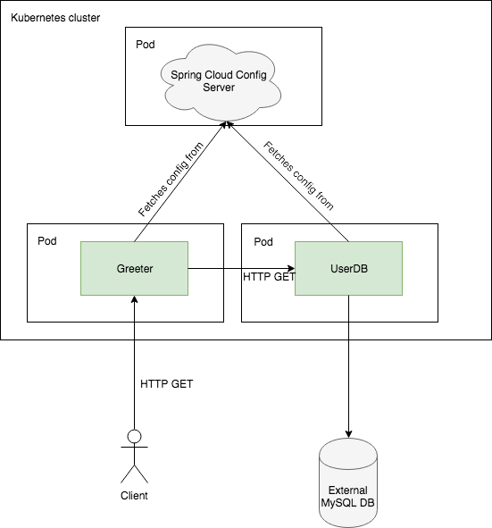

# Spring Boot Kubernetes Proof of Concept


# Usage
### Deploying
`kubectl run -f deploy.yaml`

When initially deploying, the UserDB and Greeter components will try to reach the Spring Cloud Config server(port 8888). If they cannot reach it, the applications will restart after some time until they are able to reach it. Because of all the restarts and the liveness/readiness probes, it may take a few minutes before you can start interacting with the cluster.

Once the applications are up, you can use `kubectl get svc` to find the IP of the Greeter service. Querying that IP will choose one of the Greeter endpoints among the many replicas that are deployed.

### Endpoints
#### Greeter (port 8080)
##### GET /greeting?:name
Returns "Hello, <NAME>" if the name is not found in the DB or is equal to "World", otherwise returns "Hello, <NAME>: <EMAIL>" with the email that was associated with the name in the DB. An ID is also returned, indicating how many requests were previously served on this server.

Parameters:

name: Optional. The name that will be checked against the database. The default value is "World".
    
##### GET /health
Used by the readiness probe. Returns a 200 OK only if the UserDB component can be reached.

##### GET /ping
Used by the liveness probe. Simply returns a 200 OK.

---
#### UserDB (port 12679)
##### GET /demo/get?:name
Returns the User object that has the given name. If the user is not found, a new user without an email is returned.

Parameters:

name: Required. The name that will be checked against the database.

##### GET /health
Used by the readiness probe. Returns a 200 OK only if the DB can be reached. 

##### GET /ping
Used by the liveness probe. Simply returns a 200 OK.

# Setup
If you are merely deploying the application, you only need to make sure the DB is setup and that the Kubernetes secrets have been generated. 

If you want to make changes to the application, you will probably need to create new jars and to upload the images to Docker Hub.

Note: Make sure the DB is running before executing `kubectl run -f deploy.yaml`.

### Creating JARs
In every subfolder, run `./mvnw clean package.` The jar will be then be found in the `target` folder.

### Updating Docker images
Once the JARs have been updated, in every subfolder, do:

```docker build --tag {config-test|userdb-test|greeter-test} .
docker tag {config-test|userdb-test|greeter-test} rytis6lod/{config-test|userdb-test|greeter-test}
docker push rytis6lod/{config-test|userdb-test|greeter-test}
```

Note: If you're not currently logged in, you may need to run `docker login` before being able to push.


### DB Setup
```sql
create database <INSERT DB NAME>;
create user '<INSERT USERNAME HERE>' identified by '<INSERT PASSWORD HERE>';
grant all on <INSERT DB NAME>.* to '<INSERT USERNAME HERE>';

exit;
```

Once this is done, you need to run the userdb application to create the schema. This can be done with `kubectl run -f deploy.yaml`.

Then, use your favorite DB management tool to add users to the DB.

### Generating Secrets
`kubectl create secret generic db --from-literal=url=<INSERT DB URL HERE> --from-literal=username=<INSERT USERNAME HERE> --from-literal=password=<INSERT PASSWORD HERE>`

Note: The DB url must be in a format that Spring supports. For example: `jdbc:mysql://127.0.0.1:3306/my_db_name`.
